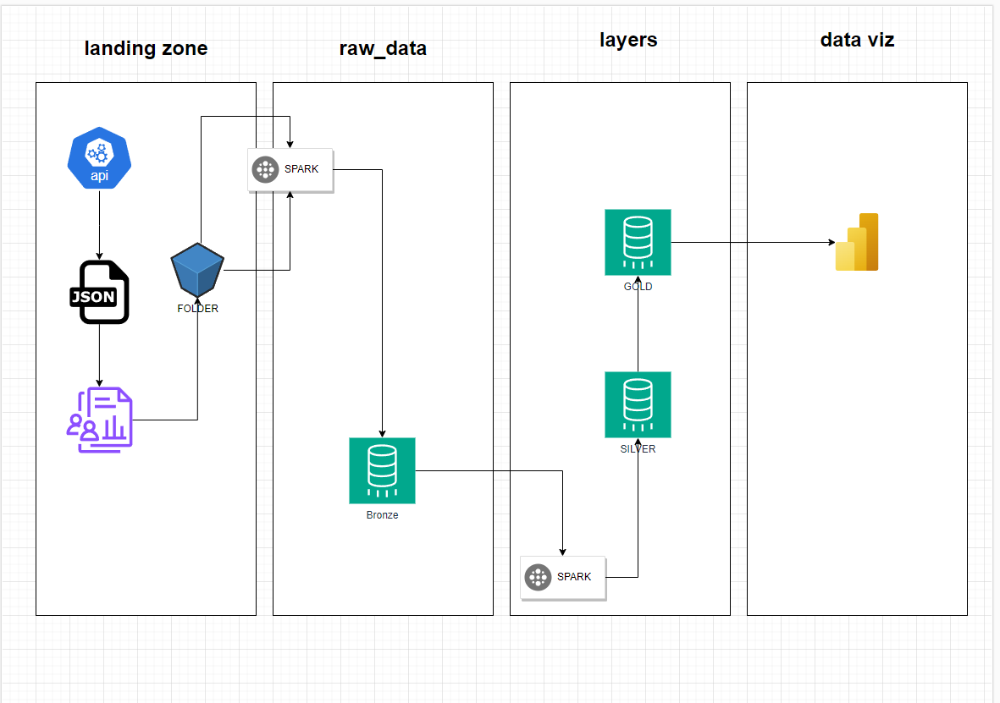
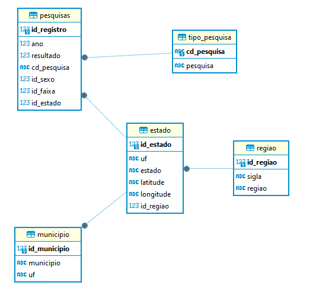

# INTEGRAÇÃO DE DADOS DO IBGE
Projeto IBGE de Pipeline de Dados
+ Engenharia (Spark)
+ Estrutura de dados SQL e Parquet
+ Data Viz - Power BI

# Estrutura do Projeto
O projeto consiste em fazer a tratativa de dados desde a raw_data até a gold_data. E a camada de visualização com PowerBi

## Ideia de Arquitetura
### Pipeline

### Modelo dos dados 
  
  

# Pré Configuração
+ Instação do Spark: https://medium.com/@MarinAgli1/setting-up-a-spark-standalone-cluster-on-docker-in-layman-terms-8cbdc9fdd14b
+ Instação do Notebook: https://jupyter.org/install

# Configuração

Este projeto requer alguns pré-requisitos e configurações específicas para ser implantado com sucesso. Siga as etapas abaixo para configurar o ambiente e executar o projeto.

## Configuração do Ambiente
### Banco de Dados:
Certifique-se de ter um banco de dados de sua preferência instalado e em execução.  
Usei como referência uma imagem postgresql https://hub.docker.com/_/postgres  
Usando o seguinte compose: https://github.com/rnaguilar/ibge_integration/blob/main/POSTGRESQL/docker-compose.yml  
**Faça ajustes adicionais no arquivo docker-compose.yml conforme necessário, como configurações de porta ou credenciais.**

### Instalação de Dependências:
Será necessario instalar as dependencias desse arquivo: https://github.com/rnaguilar/ibge_integration/blob/main/requirements.txt

## Preparar as Camadas
+ Criar as camadas **bronze_data, silver_data** e **gold_data**
+ Executar o Script na camada Silver: https://github.com/rnaguilar/ibge_integration/blob/main/SILVER_DATA/sql_start.sql
+ Executar o Script na camada: https://github.com/rnaguilar/ibge_integration/blob/main/GOLD_DATA/sql_start.sql

# Rodando o Projeto
Existe 4 arquivos ".ypynb" 
+ raw_data: instalação de pacotes de as cargas dos dados para a pasta "RAW_DATA" em formato parquet, com pyarrow
+ bronze_data: leitura desses parquet com spark fazendo seleção dos campos para o database bronze_data
+ silver_data: leitura e tratamentos dos dados da camada bronze, usando spark e pandas
+ gold_data: prepara a camada com a fato e as dimensões para ser lida no power bi
